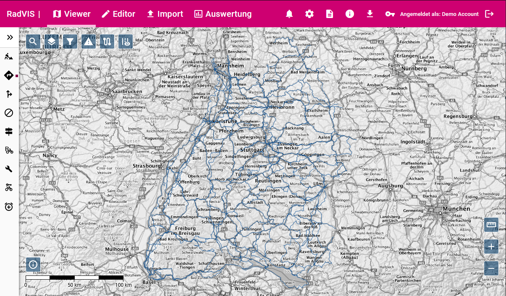
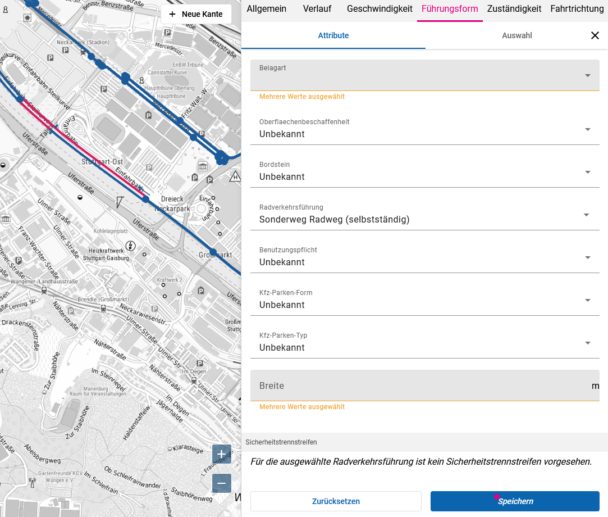
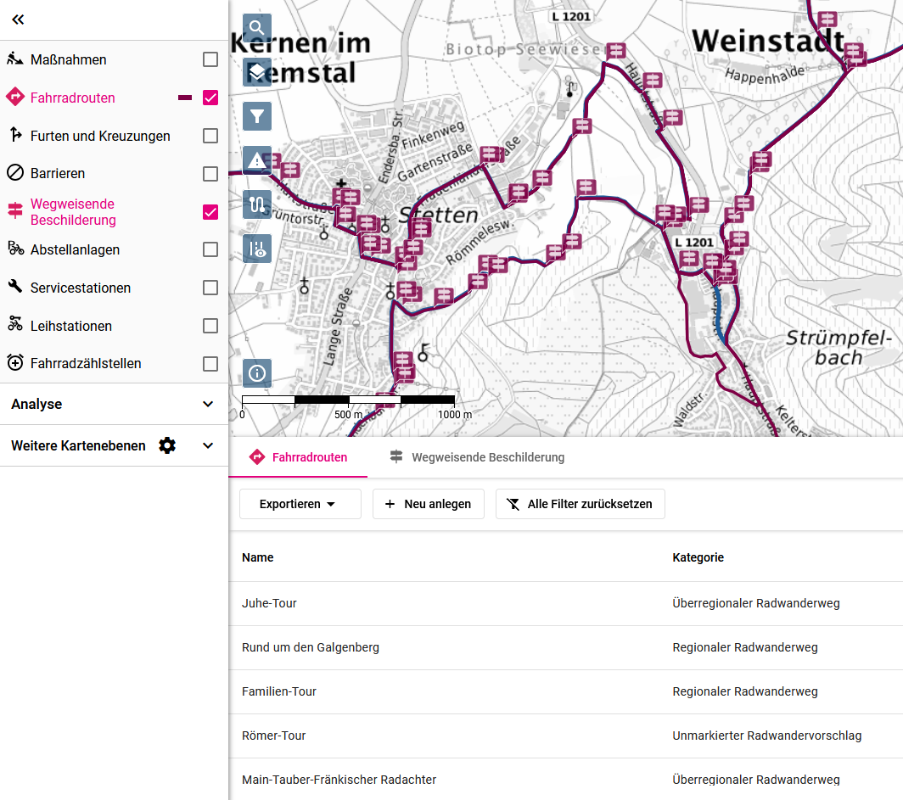

# RadVIS (Radverkehrsinfrastruktur-System)

RadVIS ist eine Client-Server-Anwendung zur Erfassung und Verwaltung der Radverkehrsinfrastruktur. Das System wurde 2021 vom _Ministerium für Verkehr Baden-Württemberg_ in Auftrag gegeben und seither stetig weiterentwickelt. Weitere Informationen und Hintergründe finden Sie auf der [Projekt-Seite zu aktivmobil BW](https://www.aktivmobil-bw.de/radverkehr/raddaten/radvis-bw/).

## Webclient

Zur Ansicht und Bearbeitung der Daten bietet RadVIS einen Webclient, der als Single-Page-Application umgesetzt ist. Zentrales Element ist die Kartenansicht, auf der die Radverkehrsinfrastruktur dargestellt und bearbeitet werden kann. Auf der Karte stehen grundlegende Werkzeuge zur Verfügung wie eine Ortssuche oder ein Messwerkzeug.

RadVIS arbeitet auf einem Knoten-Kanten-Modell (Grundnetz), in welchem alle Attribute erfasst werden, die für den Radverkehr relevant sind. Das sind z.B. Belagart, Radverkehrsführung, erlaubte Geschwindigkeit, Baulastträger uvm. Die Attribute können abschnitts- und seitengenau erfasst werden. Die Kanten des Grundnetz können außerdem einzelnen Netzklassen zugeordnet werden, sodass es möglich ist, z.B. nur das Kreisnetz anzuzeigen.

Auf dem Grundnetz können weitere Infrastrukturen rund um den Radverkehr erfasst werden. Dies beinhaltet u. A. Fahrradrouten, Maßnahmen, Barrieren und wegweisende Beschilderung. Für jede dieser Infrastrukturen sind spezifische Daten und Prozesse im System modelliert.

Die Infrastrukturen werden als Tabelle und auf der Karte dargestellt. RadVIS bietet verschiedene Formate zum Download an sowie standardisierte Geo-Dienste. Auch ein manueller Upload ist möglich; die Daten werden dann auf das bestehende Netz abgebildet und integriert.

Beim Entwickeln des Webclients wurden Gesichtspunkte wie Tastaturbedienbarkeit und Barrierefreiheit berücksichtigt.

## Server

Der Server übernimmt 3 wesentliche Aufgaben:

**Verwaltung der Nutzerdaten und fachliche Prozesse.** Dies ist nach den Prinzipien von Domain-Driven Design modelliert.

**Bereitstellung der Geo-Daten in allen erforderlichen Formaten.** Dazu wird ein dedizierter [GeoServer](https://geoserver.org/) bereitgestellt.

**Import von Daten und Abgleich dieser mit dem RadVIS-Grundnetz.** Dabei kommen verschiedene Algorithmen und Metriken zum Einsatz, um eine Abbildung der Daten vorzunehmen und deren Güte zu bewerten. Auftretende Probleme werden für Nutzer gesammelt und im Webclient dargestellt.

## Kontakt

Bei Interesse an einer Demonstration des Systems wenden Sie sich bitte an [vertrieb@wps.de](mailto:vertrieb@wps.de).